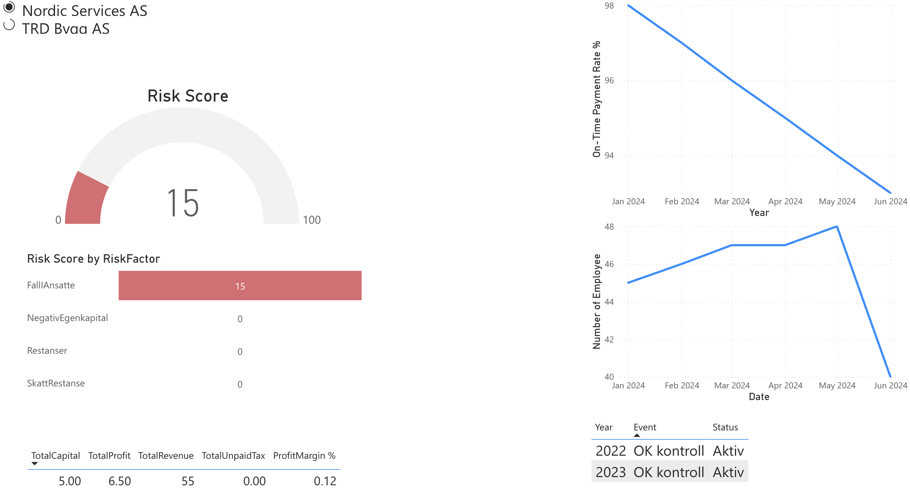
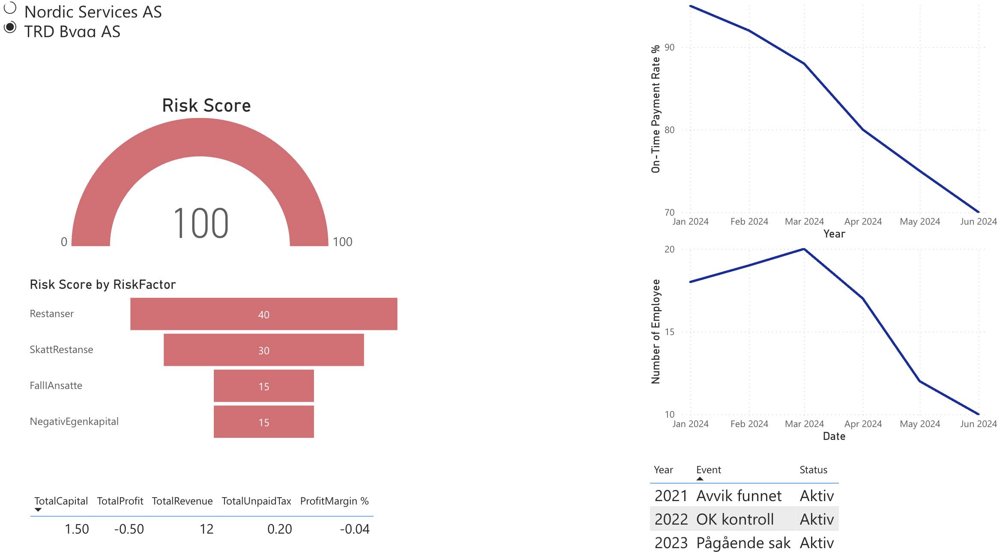

# Company Reliability Evaluation Demo

This repository contains a demo project focused on evaluating the reliability of companies using multiple data sources.  
The analysis combines:

- **Economic indicators** (profit, revenue, tax compliance)
- **Employee trends** (growth, decline, stability)
- **Control and audit history**
- **Risk factors with weighted scoring**

The purpose is to build a transparent and data‑driven foundation for assessing company stability and reliability.

---

## 📊 Data Model (Star Schema)

The data model is structured as a star‑schema‑style analytical model.  
`OrgNumber` acts as the central key connecting fact‑like tables such as:

- Financials  
- EmployeeHistory  
- PaymentHistory  
- ControlHistory  
- RiskFactors  

Surrounding these are descriptive dimensions such as **Organisations** and **RiskWeights**.

---

## 📈 Dashboards for Decision Support

The project includes example dashboards that visualize:

- Company performance over time  
- Risk scoring  
- Employee development  
- Payment behavior  
- Control and compliance events  

These dashboards help users quickly identify reliable vs. high‑risk companies.

