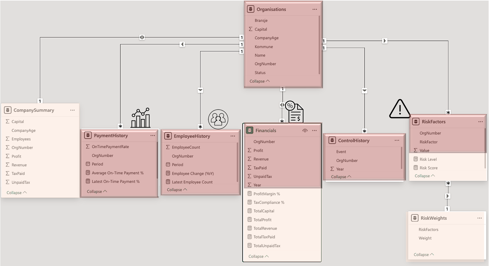

# Company Reliability Evaluation (Risk Score) Demo

This project demonstrates how to evaluate the reliability of companies based on:
- Economic performance
- Employee trends
- Control and compliance history
- Risk factors

The goal is to provide a data-driven foundation for decision‑making.

---

## 📊 Data Model (Star Schema)

---

## 📈 Dashboard for Decision Support

Below are example dashboard views used to assess company reliability:

