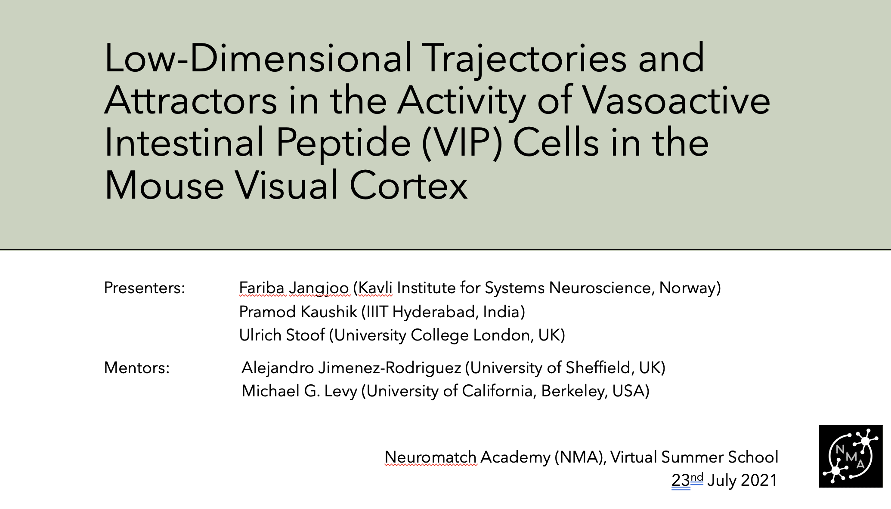

# Low-Dimensional Trajectories and Attractors in VIP Cell Activity

Team project completed at **Neuromatch Academy (NMA) 2021**, Virtual Summer School (July 2021).

**Presenters:** Fariba Jangjoo (Kavli Institute for Systems Neuroscience, Norway), Pramod Kaushik (IIIT Hyderabad, India), Ulrich Stoof (University College London, UK)
**Mentors:** Alejandro Jimenez-Rodriguez (University of Sheffield, UK), Michael G. Levy (UC Berkeley, USA)

## Research question

VIP (vasoactive intestinal peptide) cells are a major class of inhibitory interneuron in sensory cortex — they mediate top-down influences and respond differently to familiar vs. novel stimuli, but their population-level dynamics hadn't been explored in low-dimensional space. We asked: can VIP cell dynamics be characterized as trajectories in a low-dimensional space, and can traces of memory be found in that activity?

## Method

Using the Allen Institute's 2-photon Visual Behavior dataset (mice trained to detect image changes, with 5% of trials randomly omitted), we extracted VIP cell activity around two types of events — image changes and stimulus omissions — smoothed the traces, and used PCA to project population activity into 2–3 dimensions to visualize it as trajectories.

My contribution was building the analysis pipeline end-to-end: extracting event-triggered windows, constructing the trial × cell response matrix, computing the covariance structure, and running PCA to derive and visualize the low-dimensional trajectories (see `allen_visual_behavior_from_sdk.py`).

## Findings

- **Image changes** trigger movement between two distinct attractors (a heteroclinic transition) — consistent with a bifurcation where one stable state loses stability.
- **Stimulus omissions**, by contrast, don't trigger a change of attractor — the trajectory returns to the same state it started from (homoclinic).
- Some evidence of memory traces in sessions with familiar images.

Full results and figures: [`NMA_2021_Low-Dimensional Dynamics of VIP Cells_Version 2.pptx`](./NMA_2021_Low-Dimensional%20Dynamics%20of%20VIP%20Cells_Version%202.pptx)

## Files in this folder

- **`allen_visual_behavior_from_sdk.py`** — the actual analysis: event-triggered response extraction, smoothing, and PCA trajectory/attractor analysis described above
- **`NMA_2021_Low-Dimensional Dynamics of VIP Cells_Version 2.pptx`** — final presentation slides
- `Allen_Visual_Behavior_from_pre_processed_file.ipynb`, `load_Allen_Visual_Behavior_from_SDK.ipynb`, `visual_behavior_load_ophys_data.ipynb`, `visual_behavior_compare_across_trial_types.ipynb` — **Allen Institute's own AllenSDK tutorial notebooks**, used during the project to learn how to load and access the dataset; not original analysis

